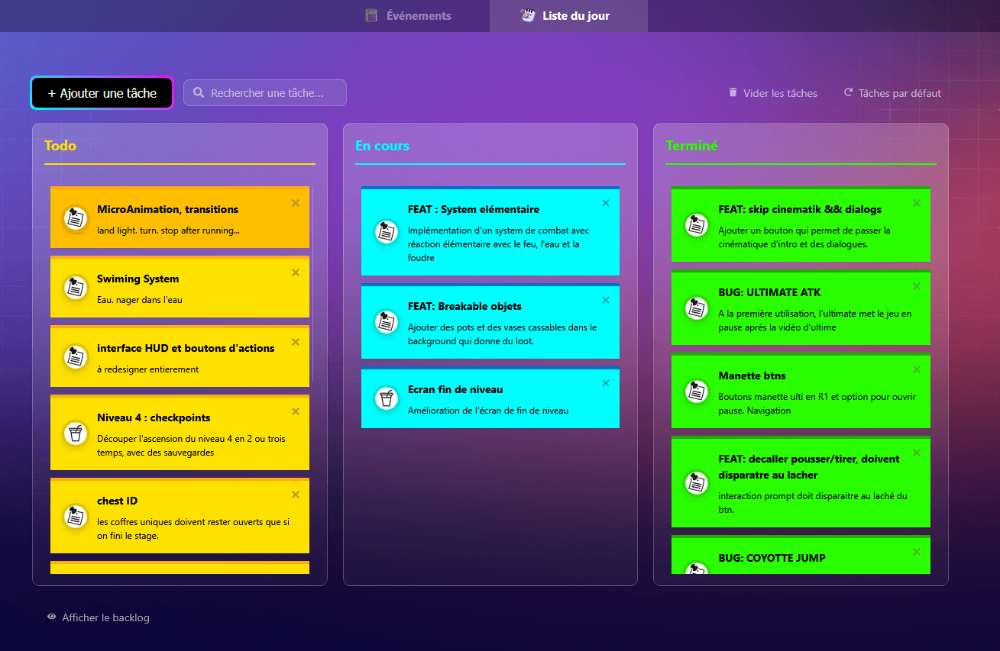

# 📅 Dayz

Un planificateur quotidien moderne et intuitif pour gérer, organiser et optimiser votre temps au quotidien et pour les jours à venir.

**[Voir la démo →](https://sailan-obii.github.io/dayz)**



---

## ✨ Fonctionnalités

### 📋 **Today** - Gestion des tâches du jour
- **Tableau Kanban** avec 3 colonnes : À faire, En cours, Backlog
- **Drag & drop** fluide pour réorganiser vos tâches
- **Édition inline** des tâches (titre et description)
- **Système de priorités** visuelles avec icônes et couleurs
- **Backlog** caché/visible pour une meilleure concentration
- **Persistance locale** avec localStorage
- **PWA** (Progressive Web App) - fonctionne hors ligne
- **Responsive design** - mobile, tablet, desktop

---

## 🛠️ Stack technologique

- **Frontend** : React 18.3 + Vite 6
- **Router** : React Router 6
- **Styles** : Styled-components 6
- **Drag & Drop** : @hello-pangea/dnd
- **Dates** : date-fns 4
- **Icônes** : React Icons 5
- **PWA** : Vite PWA Plugin
- **Linter** : ESLint 9

---

## 🚀 Installation

### Prérequis
- Node.js 16+ 
- npm ou yarn

### Étapes

```bash
# Cloner le projet
git clone https://github.com/sailan-obii/dayz.git
cd dayz

# Installer les dépendances
npm install

# Démarrer le serveur de développement
npm run dev
```

L'application ouvrira à `http://localhost:5173`

---

## 📦 Commandes disponibles

| Commande | Description |
|----------|-------------|
| `npm run dev` | Lance le serveur de développement (Vite) |
| `npm start` | Alias pour `npm run dev` |
| `npm run build` | Compile pour la production |
| `npm run preview` | Prévisualise la build de production |
| `npm run lint` | Vérifie le code avec ESLint |
| `npm run deploy` | Deploy sur GitHub Pages |

---

## 📁 Structure du projet

```
dayz/
├── src/
│   ├── pages/
│   │   ├── Today.jsx          # Page gestion des tâches du jour
│   │   └── Upcoming.jsx       # Page événements futurs
│   ├── components/
│   │   ├── Task/              # Composants spécifiques aux tâches
│   │   │   ├── EditableTask.jsx
│   │   │   ├── TaskIcon.jsx
│   │   │   ├── TopBar.jsx
│   │   │   └── today.styles.js
│   │   ├── atoms/             # Composants réutilisables
│   │   ├── ButtonPrimary.jsx  
│   │   ├── EventCardComponent.jsx
│   │   ├── EventModal.jsx
│   │   ├── EventsSection.jsx
│   │   └── Navigation.jsx
│   ├── assets/                # Images et ressources
│   ├── App.jsx                # Composant racine
│   ├── index.css              # Styles globaux
│   ├── main.jsx               # Point d'entrée
│   └── theme.js               # Configuration du thème
├── public/                    # Fichiers statiques
├── vite.config.js             # Configuration Vite
├── eslint.config.js           # Configuration ESLint
└── package.json               # Dépendances et scripts

```

---

## 💾 Stockage des données

Les données sont stockées **localement** dans le navigateur avec `localStorage` :
- **Tâches** : clé `tasks`
- **Événements** : clé `events`

Aucun serveur n'est requis - vos données restent privées sur votre appareil.

---

## 🌐 Déploiement

Le projet est configuré pour être déployé sur **GitHub Pages** :

```bash
npm run deploy
```

Cela va :
1. Builder le projet
2. Déployer le dossier `dist/` sur la branche `gh-pages`
3. Le site sera accessible à `https://sailan-obii.github.io/dayz`

---

## 📱 PWA (Progressive Web App)

Dayz est une PWA complète :
- ✅ Fonctionne hors ligne
- ✅ Installation sur l'écran d'accueil
- ✅ Mises à jour automatiques
- ✅ Support des icônes adaptées à l'appareil

---

## 🎯 Feuille de route

- [ ] Synchronisation cloud (Firebase/Supabase)
- [ ] Thème sombre/clair
- [ ] Récurrence d'événements
- [ ] Tags et catégories
- [ ] Statistiques et analytics

---

## 📄 Licence

MIT

---

## 👤 Auteur

**sailan-obii**

---

## ❓ Support

Des questions ou des suggestions ? Ouvrez une [issue](https://github.com/sailan-obii/dayz/issues) !

---

Fait avec ❤️ pour une meilleure gestion du temps